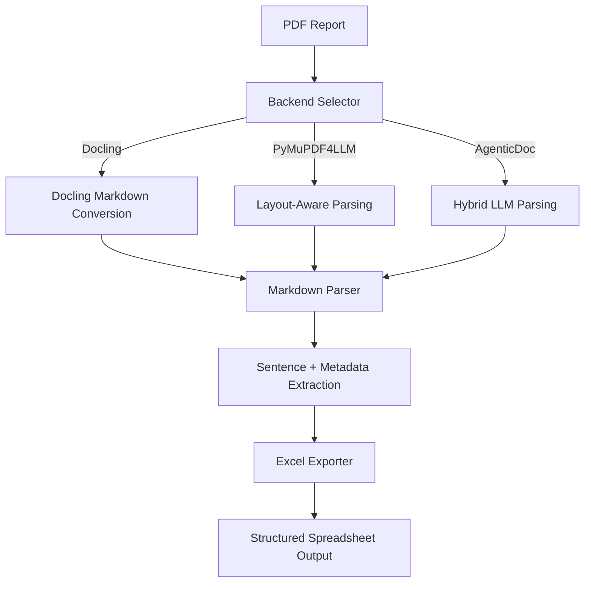

# 📃 Doc-Flow 2.0

**From PDFs to Insights: A Hybrid Domain-Agnostic Document Parser**

[](https://doc-flow.streamlit.app/) [](https://www.linkedin.com/in/salitahir/) [](mailto:s.ali.tahir@outlook.com)

---

## 📌 Project Overview

**DocFlow 2.0** is a hybrid document-to-structured-data pipeline designed to help researchers, analysts, and builders extract **clean, analyzable text** from complex PDF reports. It automates the messy task of parsing long-form documents—turning them into ready-to-use spreadsheets for labeling, analytics, or model training. 

📎 [Workflow Demo](#) *(temporary placeholder)*

---

## 🚀 Key Features

| Component                     | Description                                                                                                              |
|-------------------------------|--------------------------------------------------------------------------------------------------------------------------|
| **Multi-Backend PDF Parsing** | Choose between **Docling (recommended)**, **PyMuPDF4LLM**, or **AgenticDoc** — each optimized for different report types |
| **Sentence-Level Extraction** | Converts documents into clean, context-rich sentences while preserving headings and bullet structures                    |
| **Metadata Tagging**          | Flags heading hierarchy, bullet state, table membership, and more                                                        |
| **Spreadsheet Export**        | Outputs directly to `.xlsx` with metadata columns for easy filtering and analysis                                        |
| **Transparent Logging**       | Detailed logs at each stage of the process for reproducibility and debugging                                             |
| **Streamlit UI**              | Simple interface to upload, select backend, and extract data interactively                                               |

---

## 🧠 Architecture



---

## 📂 Project Layout
| Path                               | Description                                                                    |
|------------------------------------|--------------------------------------------------------------------------------|
| `docflow/backends/`                | Interfaces for multiple PDF parsing engines (Docling, PyMuPDF4LLM, AgenticDoc) |
| `docflow/cli.py`                   | Command-line entry point for local batch runs                                  |
| `docflow/export.py`                | Excel writer and formatting utilities                                          |
| `docflow/sentence_postprocess.py`  | Sentence segmentation and cleanup routines                                     |
| `docflow/text_clean.py`            | Markdown normalization helpers                                                 |
| `docflow/utils/`                   | Shared utilities (logging, constants, and I/O)                                 |
| `app/`                             | Streamlit prototype for interactive document uploads and backend selection     |

---

## 🗃️ Output Columns
| Column              | Description                                                     |
|---------------------|-----------------------------------------------------------------|
| `Source`            | Filename or identifier of the uploaded PDF                      |
| `Page_No`           | Source page tracking                                            |
| `Line_No`           | Line number within the parsed Markdown                          |
| `Section Type`      | Sentence, heading, table, bullet, etc.                          |
| `Heading Level`     | Hierarchical depth (H1, H2, H3)                                 |
| `Is Table`          | Indicates if the text originated from a table                   |
| `H1` / `H2` / `H3`  | Captured headings based on detected structure                   |
| `Section`           | Section path constructed from headings                          |
| `Current Section`   | Closest heading context                                         |
| `Text`              | Extracted sentence or paragraph                                 |

---

## ⛳ Quickstart
```bash
python -m pip install -r requirements.txt
python -m streamlit run app/streamlit_app.py
# or CLI:
python -m docflow.cli --in sample.pdf --out outputs/sample.xlsx
```


---

## ⚙️ Streamlit Interface
DocFlow ships with a Streamlit UI that makes experimentation simple:
1. Upload a PDF file.
2. Select a backend (Docling, PyMuPDF4LLM, or AgenticDoc).
3. Preview the structured rows and download `.xlsx`/`.csv` outputs.
---

Run locally with:
```bash
python -m streamlit run app/streamlit_app.py
```

---

## Command Line Usage
Use the CLI for batch jobs or automation:
```bash
python -m docflow.cli --in path/to/document.pdf --out outputs/document.xlsx --backend docling
```
---

## 📚 Citation & Credit

**Syed Ali Tahir** >
✉️ [tahirsy@tcd.ie](mailto:tahirsy@tcd.ie) >
✉️ [s.ali.tahir@outlook.com](mailto:s.ali.tahir@outlook.com) >
🔗 [LinkedIn: syed-ali-tahir](https://www.linkedin.com/in/salitahir/)
