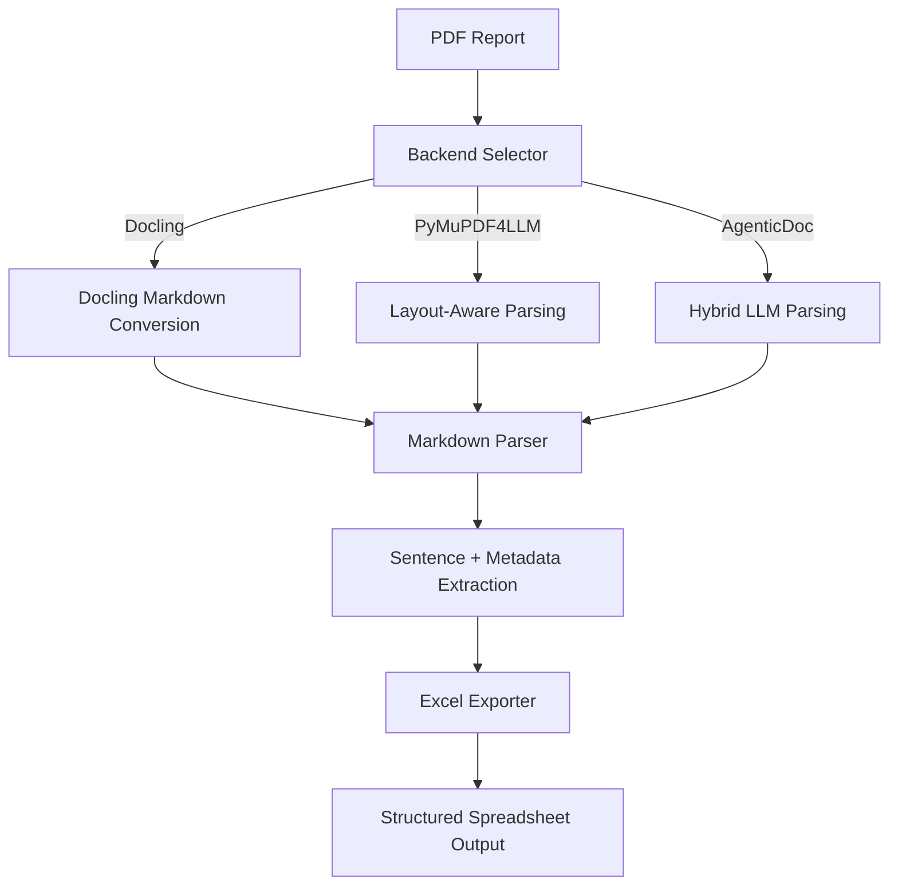

# 🌿 Green-Guard 2.0  
**From PDFs to Insights: A Hybrid Document Parser for Sustainability and Compliance Analytics**

[](https://greenguard-documentparser.streamlit.app/) [](https://www.linkedin.com/in/salitahir/) [](mailto:s.ali.tahir@outlook.com)

---

## 📌 Project Overview

**Green Guard 2.0** is a hybrid document-to-structured-data pipeline designed to help researchers and analysts extract **clean, analyzable text** from complex PDF reports. It automates the messy task of parsing sustainability, ESG, and compliance reports — turning them into **ready-to-use spreadsheets** for labeling, analytics, or model training.

📎 [Slide Deck: Overview & Workflow Demo](#) *(optional link placeholder)*

---

## 🚀 Key Features

| Component                     | Description                                                                                                              |
|-------------------------------|--------------------------------------------------------------------------------------------------------------------------|
| **Multi-Backend PDF Parsing** | Choose between **Docling (recommended)**, **PyMuPDF4LLM**, or **AgenticDoc** — each optimized for different report types |
| **Sentence-Level Extraction** | Converts documents into clean, context-rich sentences while preserving headings and bullet structures                    |
| **Metadata Tagging**          | Flags heading hierarchy, bullet state, table membership, and more                                                        |
| **Spreadsheet Export**        | Outputs directly to `.xlsx` with metadata columns for easy filtering and analysis                                        |
| **Transparent Logging**       | Detailed logs at each stage of the process for reproducibility and debugging                                             |
| **Streamlit UI**              | Simple interface to upload, select backend, and extract data interactively                                               |

---

## 🧠 Architecture



---

## 📂 Project Layout

| Path                                 | Description                                                                    |
|--------------------------------------|--------------------------------------------------------------------------------|
| `extractor/backends/`                | Interfaces for multiple PDF parsing engines (Docling, PyMuPDF4LLM, AgenticDoc) |
| `extractor/cli.py`                   | Command-line entry point for local batch runs                                  |
| `extractor/export.py`                | Excel writer and formatting utilities                                          |
| `extractor/sentence_postprocess.py`  | Sentence segmentation and cleanup routines                                     |
| `extractor/text_clean.py`            | Markdown normalization helpers                                                 |
| `extractor/utils/`                   | Shared utilities (logging, constants, and I/O)                                 |
| `app/`                               | Streamlit prototype for interactive document uploads and backend selection     |

---

## 🗃️ Example Output Columns

| Column             | Description                             |
|--------------------|-----------------------------------------|
| `text`             | Extracted sentence or paragraph         |
| `heading_level`    | Hierarchical depth (e.g., H1, H2, H3)   |
| `is_bullet`        | Boolean flag for bullet points          |
| `is_table`         | Identifies text originating from tables |
| `page_number`      | (Optional) Source page tracking         |
| `section_context`  | Detected section heading or topic       |

---

## 🎯 Use Cases

- **ESG & Sustainability Research**  
  Extract claims, metrics, and disclosures from corporate reports  
- **Compliance & Regulatory Analytics**  
  Build structured evidence datasets for audit automation  
- **AI Labeling Pipelines**  
  Prepare sentence-level corpora for NLP model training  
- **Document Intelligence Applications**  
  Power downstream insight generation or Q&A systems  

---

## 🏁 Local Setup

```bash
git clone https://github.com/salitahir/green_guard.git
cd green_guard
pip install -r extractor/requirements.txt

# Run the CLI pipeline
python extractor/cli.py --in path/to/your.pdf --out outputs/your.xlsx --log-level INFO
````

✅ This command converts your PDF into an Excel workbook with structured columns ready for analysis or labeling.

---

## ⚙️ Streamlit Interface

Green Guard also includes a lightweight **Streamlit UI** that allows you to:  
1. Upload a PDF file  
2. Select a backend (**Docling**, **PyMuPDF4LLM**, or **AgenticDoc**)  
3. View logs and download structured `.xlsx` output  

Example interface:

This visual dropdown lets users switch between **three distinct extraction methods** —  
- 🧩 **Docling (Recommended):** Most stable and layout-preserving  
- ⚡ **PyMuPDF4LLM:** Lightweight and fast for dense text reports  
- 🧠 **AgenticDoc:** Hybrid agentic parser for AI-assisted extraction  

Each backend provides different strengths depending on document complexity and structure.

## 📚 Citation & Credit

**Syed Ali Tahir** >
✉️ [tahirsy@tcd.ie](mailto:tahirsy@tcd.ie) >
✉️ [s.ali.tahir@outlook.com](mailto:s.ali.tahir@outlook.com) >
🔗 [LinkedIn: syed-ali-tahir](https://www.linkedin.com/in/salitahir/)

© 2025 Syed Ali Tahir. All rights reserved. No redistribution without permission.  
